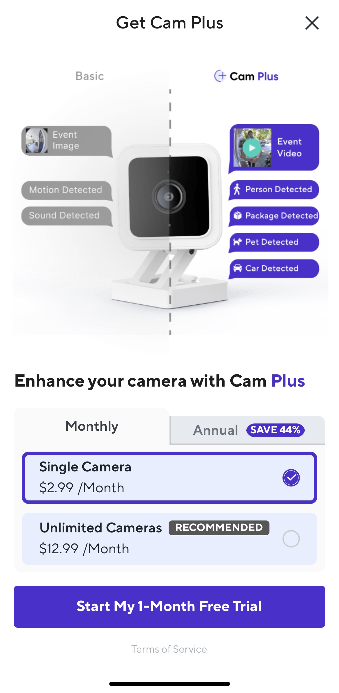
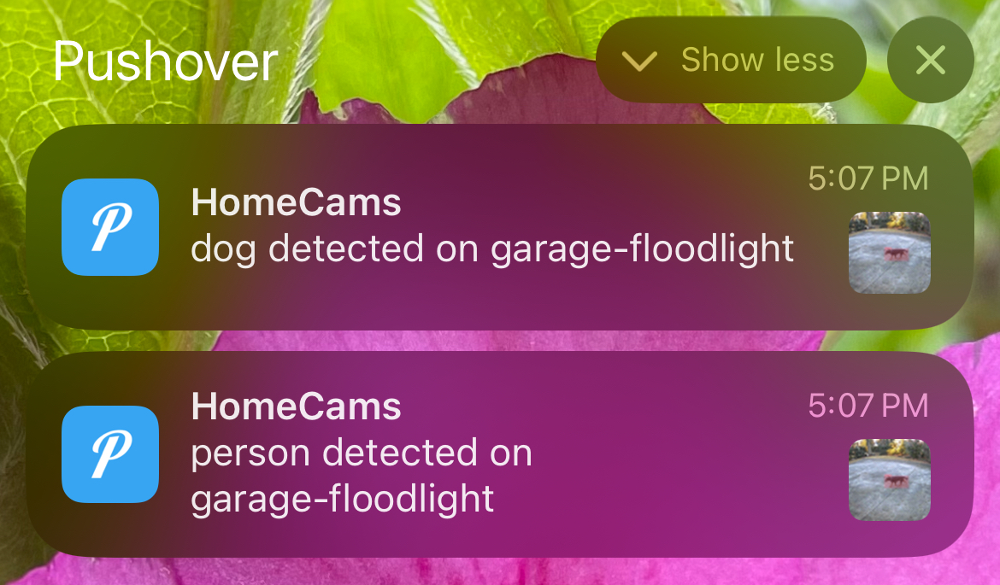

# Argus
An efficient object detector and notification agent that runs locally on CPU.

Ditch the subscription just for basic object detection...


## Setup
Argus works for any IP based camera that supports RTSP/RTMP. The original motivation was to improve the standard pixel based detection on Wyze cameras that lead to alarm fatigue. To get an RTSP/RTMP stream from wyze cameras just set up [Wyze Bridge](https://github.com/mrlt8/docker-wyze-bridge).

To recieve notifications on your phone set up a [Pushover](https://pushover.net) account. Setup is easy and getting detection push notifications with the detection image is well worth the $5 one time payment. If you want to go completely free then the notification function in Argus can be re-written to use email, sms, or another notification method.

To run Argus use the following docker compose file to start a service (or two).

```
version: '2.4'
services:
  yoloweb:
    container_name: argus
    restart: unless-stopped
    command: python3 /Argus/run.py --ip 0.0.0.0 --port 8080 --detections person car dog cat # see YOLOV8Inference.py for available classes
    image: wanaylor235/argus:arm
    ports:
      - 8080:8080
      - 8554:8554
    environment:
      - UPSTREAM_URL=rtsp://10.10.10.10:8554/back-yard # url of camera stream, accepts authenticated streams
      - MY_IP=0.0.0.0
      - UPSTREAM_PROTO=rtsp
      - UPSTREAM_IP=10.10.10.10
      - UPSTREAM_PORT=8554
      - UPSTREAM_ROUTE=back-yard    # this gets put in the notifications
      - ONNX_MODEL=./models/yolov8n.onnx # you can chose your own model
      - DETECTION_RESET_SECONDS=1200 # timeout for re-notifying on a detection class
      - APP_TOKEN=your-pushover-app-token
      - USER_TOKEN=your-pushover-user-token
      - CONF_THRES=0.7 # how sensitive to be about detections
    working_dir: /Argus
```

## Usage
Argus has been tested to run two container instances on a Raspberry Pi 4B with no extra compute modules. However, this does consume most of the compute resources and it will run warm. The Pi usually cannot run detections and serve the web page for viewing but laptops don't have an issue.

Responsiveness is generally within a few seconds. Argus polls the camera every seconds and it may take Pushover a second to get the notification to you. 



## TODO
- Implement an RTSP server, making Argus a middleware. This will allow it to sit between security cams and NVRs allowing the detections to be recorded.
- Implement intermediate tracking. For security camera uses, object detection doesn't need to happen 30 times a second. Detection every second is enough and OpenCV has many methods built in for object tracking. 
